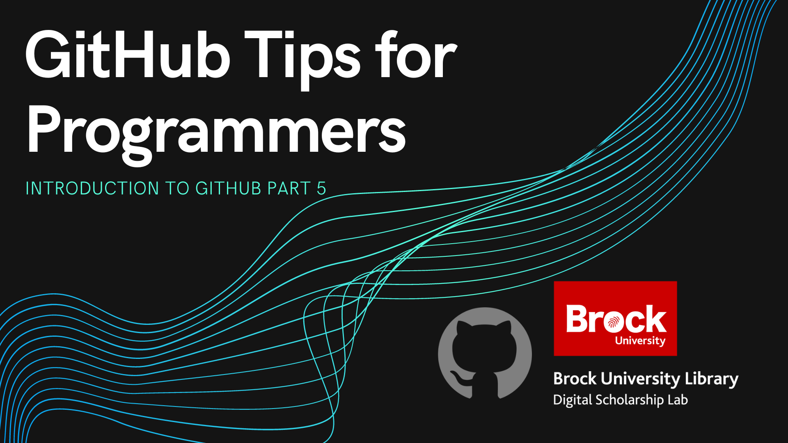

# GitHub Tips for Programmers

In this workshop, attendees will learn about some of the most useful tools that GitHub offers for programmers such as Codespaces, integrated VS Code, and more.  This workshop is the fifth and final workshop in the GitHub Workshop Series offered by the Brock University Digital Scholarship Lab.

An understanding of using GitHub and basic experience with a programming language is recommended (but not required) to get the most out of this workshop.  

*Estimated workshop length: 1.5 hours*

----
## Setup
In preparation for this workshop, you will need the following: 

 - A GitHub account which you can get by clicking the "Sign Up" button at the top right of [https://github.com/](https://github.com/).
 - A GitHub repository to use for the workshop.  Even a new repository with just a README.md file will work.
  
----
## Helpful Materials

[GitHub Codespaces Homepage](https://github.com/features/codespaces): GitHubs official page discussing what is possible with Codespaces.  

----
## Workshop Tasks
Tasks under development, check back soon!

## Next Steps

After completing this workshop, the recommended next steps are:

 - Try out your own configurations of Codespaces.  The more you try it out the easier it will be to use when you need it!
 - Check out the other workshops in our introduction to GitHub Series
   - [Introduction to GitHub Repositories and GitHub Desktop](https://brockdsl.github.io/Introduction-to-GitHub-Repositories-and-GitHub-Desktop/)
   - [Collaborating with Version Control on GitHub](https://brockdsl.github.io/Collaborating-with-Version-Control-on-GitHub/)
   - [Making a Free Webpage with GitHub Pages](https://brockdsl.github.io/Making-a-Free-Webpage-with-GitHub-Pages/)
   - [Automating tasks with GitHub Actions](https://brockdsl.github.io/Automating-tasks-with-GitHub-Actions/)
  
 
 ----

  
**This workshop is brought to you by the Brock University Digital Scholarship Lab.  For a listing of our upcoming workshops go to [Experience BU](https://experiencebu.brocku.ca/organization/dsl) if you are a Brock affiliate or our [Eventbrite page](https://www.eventbrite.ca/o/brock-university-digital-scholarship-lab-21661627350) for external attendees.**

